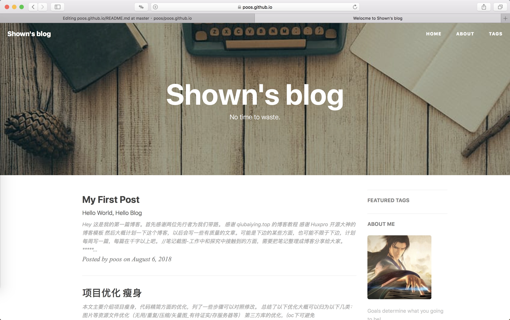
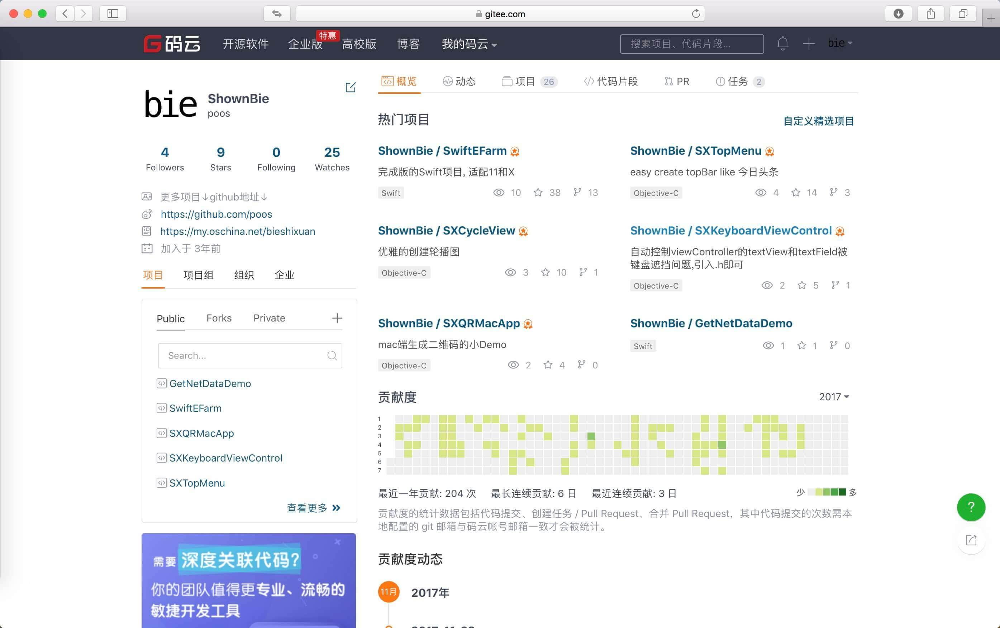
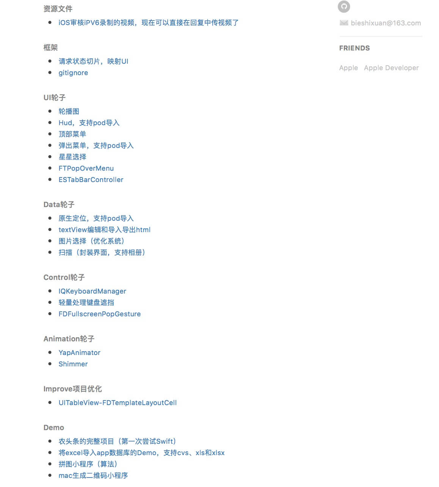
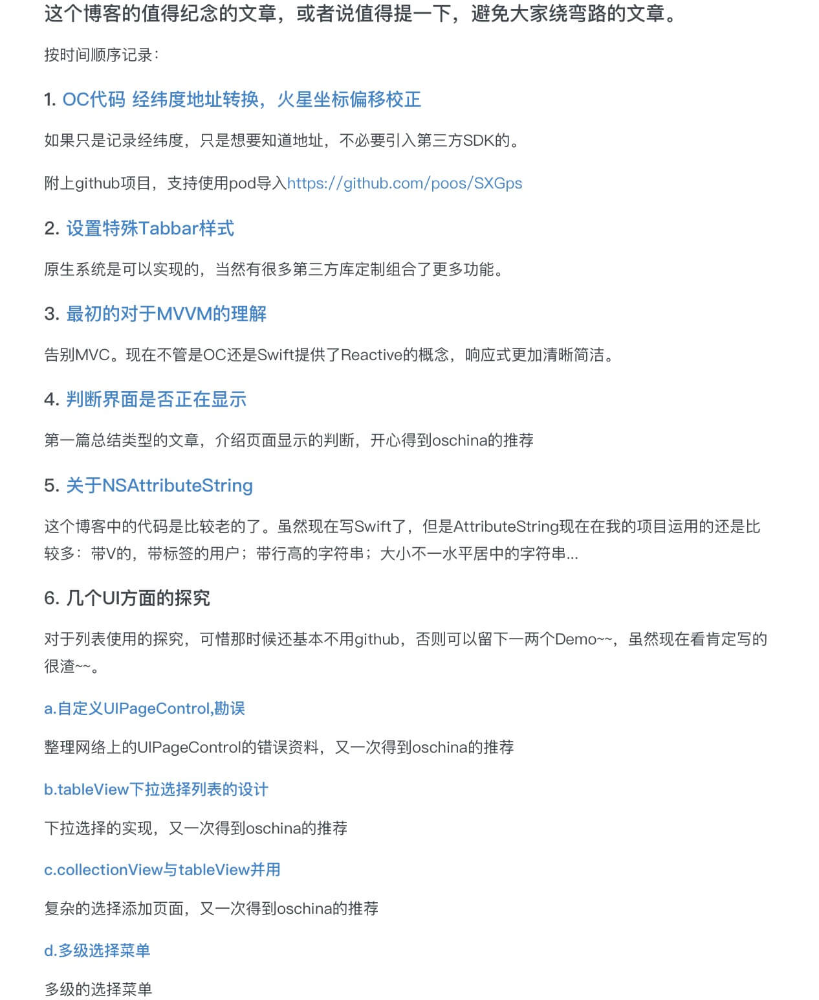
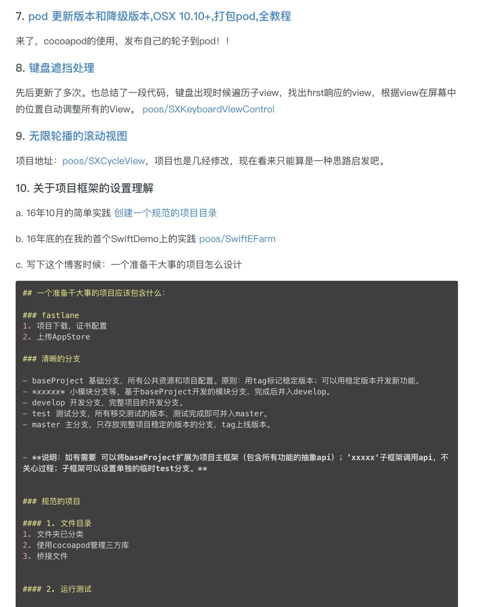

# Shown's Blog

>

## [我的博客在这里 &rarr;](https://poos.github.io)

---
---

## 一些放在gitee的项目，开源的项目部分得到了推荐，，[点击链接进入>>>>](https://gitee.com/poos)

---
---

## 一些写过的轮子和Demo。还有对框架学习的理解。大部分是自己造的，也有Fork其他前辈后修改的，也有只是Fork来学习的，列表在下边列出，[点击链接进入>>>>](https://poos.github.io/about/)

进入链接可查看

---

## 之前[oschina/bieshixuan](https://my.oschina.net/bieshixuan/blog/2236855)没有搬家时候的一些有趣的文章，列表在下边列出，[点击链接进入>>>>](https://poos.github.io/2018/06/06/Begin/)

## 致谢

1. 这个模板是从这里 [Hux](https://github.com/Huxpro/huxpro.github.io) fork 的, 感谢这个作者。
2. 感谢 Jekyll、Github Pages 和 Bootstrap!
3. 感谢 [BY Blog](http://qiubaiying.top/2017/02/06/快速搭建个人博客/) 提供的搭建方案。

## License

遵循 MIT 许可证。有关详细,请参阅 [LICENSE](https://github.com/qiubaiying/qiubaiying.github.io/blob/master/LICENSE)。
